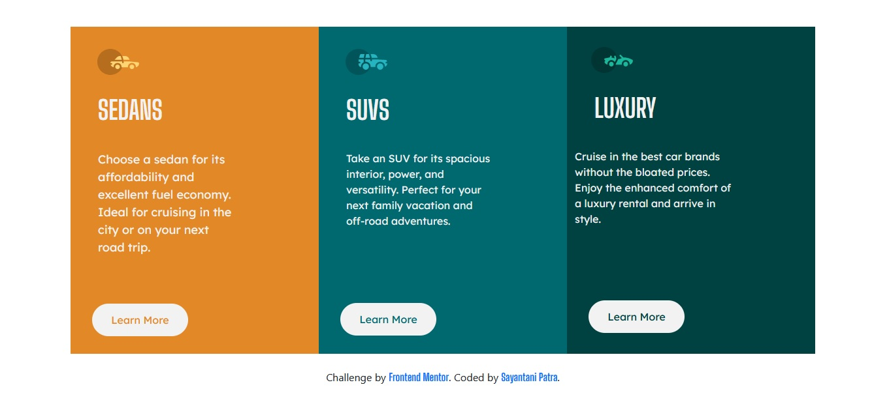

# Frontend Mentor - 3-column preview card component solution

This is a solution to the [3-column preview card component challenge on Frontend Mentor](https://www.frontendmentor.io/challenges/3column-preview-card-component-pH92eAR2-). Frontend Mentor challenges help you improve your coding skills by building realistic projects. 

## Table of contents
  - [Screenshot](#screenshot)
  - [Links](#links)
- [My process](#my-process)
  - [Built with](#built-with)
  - [What I learned](#what-i-learned)
  - [Continued development](#continued-development)
  - [Useful resources](#useful-resources)
- [Author](#author)
- [Acknowledgments](#acknowledgments)

### Screenshot



This is my solution, of this project.

### Links

- Solution URL: [solution URL](https://github.com/iamsayantanipatra/3_column_preview_cards)
- Live Site URL: [Live Solution Page](https://3-column-preview-card-by-sayantani.netlify.app/)

## My process

### Built with

- Semantic HTML5 markup
- CSS custom properties
- Flexbox
- CSS Grid
- Mobile-first workflow
- [Bootstrap](https://getbootstrap.com/) - Bootstrap
- [SASS/SCSS](https://nextjs.org/) - SASS/SCSS

### What I learned
I learned about bs5 columns, media queries, etc

To see how you can add code snippets, see below:

```html
 <div class="col col__3">
        
        <div class="text-box">
          <h1>Luxury</h1>
          <p>Cruise in the best car brands without the bloated prices. Enjoy the enhanced comfort of a luxury
            rental and arrive in style.</p>
          <button class="btn btn__3">Learn More</button>
        </div>
      </div>
```
```scss
.col__3 {
  background-color: $Very-dark-cyan;
  width: 306px;
  height: 502px;

  img {
    padding-left: 25px;
    padding-top: 31px;
  }

  & .text-box {
    p {
      width: 15pc;
      color: $Very-light-gray;
      font-family: "Lexend Deca", sans-serif;
      margin-left: 30px;
    }
    & .btn__3 {
      width: 147px;
      height: 50px;
      background-color: $Very-light-gray;
      color: $Very-dark-cyan;
      font-family: "Lexend Deca", sans-serif;
      border-radius: 30px;
      margin: 97px 21px;
    }
  }
}
```

### Continued development
I would be more focusing on css grids and flexboxs, learning more about sass/scss, javascript,bootstrap also

### Useful resources

- [W3 Schools](https://w3schools.com) - This helped me to understand the media queries. I really liked this pattern and will use it going forward.
- [MDN Reference](https://developer.mozilla.org/en-US/docs/Web/CSS/columns) - This is an amazing article which helped me finally understand CSS Columns. I'd recommend it to anyone still learning this concept.

## Author

- Website - [Sayantani Patra](https://github.com/iamsayantanipatra)
- Frontend Mentor - [@iamsayantanipatra](https://www.frontendmentor.io/profile/iamsayantanipatra)

## Acknowledgments

W3SCHOOLS, BOOTSTRAP 5, csstricks.com, google fonts helped me to understand the media queries, css grids and flebox. Google fonts helped me to give my website a beautiful look!
